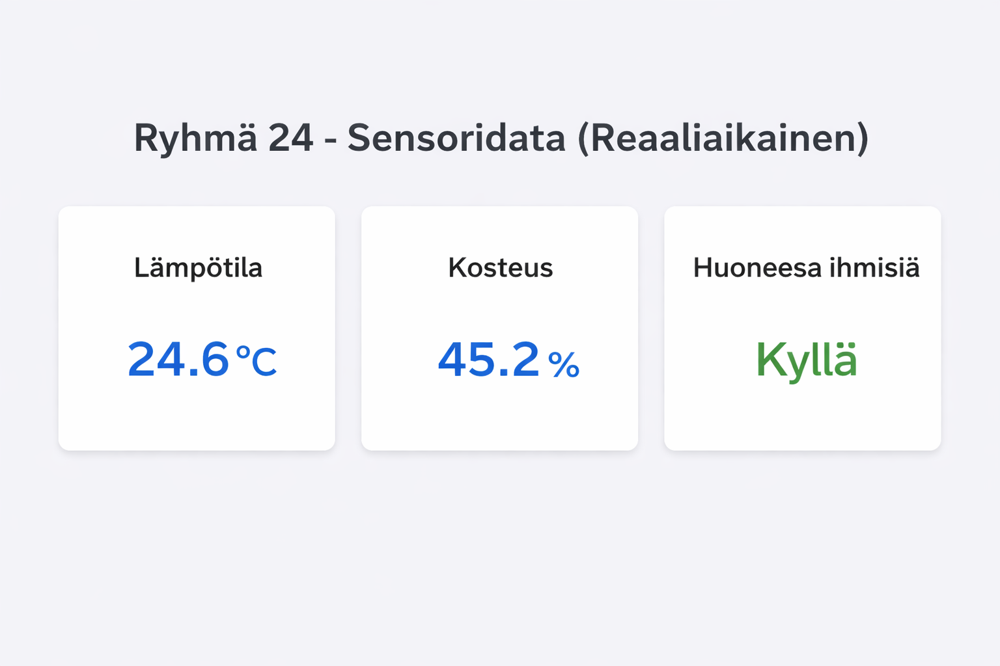
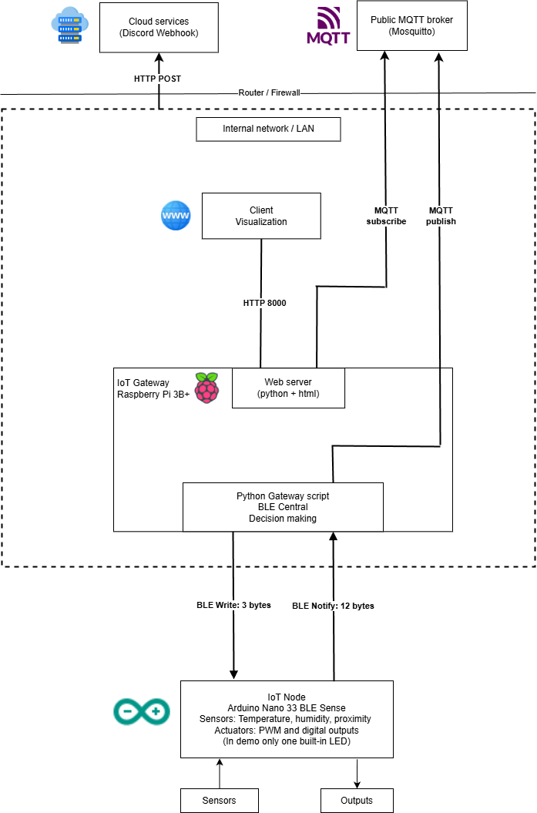

# 🏠 Smart Room Environment & Occupancy Monitor

IoT course project for **COMP.CE.450 – Internet of Things**

---

## 👨‍💻 Group 24

- Tuomas Puhakainen – https://github.com/Tuomar2  
- Eero Kainulainen – https://github.com/dfeeka
- Lasse Keränen

---

## 📋 System Overview

This prototype is a **smart room monitoring system** that measures indoor environmental conditions and detects room occupancy.

The system uses sensors to monitor **temperature, humidity, and proximity**, allowing it to track the room climate and determine whether someone is present.

The primary function of the system is to react to these changing conditions. For example:

- Increase cooling if temperature or humidity rises
- Turn on lighting when occupancy is detected
- Trigger alerts if environmental conditions exceed defined thresholds

This project demonstrates a **concept IoT system capable of sensing, analyzing, and reacting to environmental changes in a room**.

## Data Visualization Dashboard

The prototype includes a simple web dashboard that visualizes the sensor data in real time.  
The Raspberry Pi publishes the processed sensor data to an MQTT broker, and the dashboard subscribes to this topic to display the measurements.

## ⚙️ Features

- 🌡️ Environmental monitoring
- 👤 Room occupancy detection
- 📡 BLE communication between constrained device and gateway
- ☁️ MQTT data publishing
- 🌐 HTTP web dashboard visualization
- 🚨 Discord webhook alerts

## 🏗️ System Architecture & Data Flow

The **Arduino Nano 33 BLE Sense** collects sensor measurements and sends them via **Bluetooth Low Energy (BLE)** to the Raspberry Pi gateway.

The **Raspberry Pi** processes the sensor data, performs analysis, publishes the results to an **MQTT broker**, and sends control signals back to the Arduino for actuation.

Sensor data is visualized through a **simple HTTP web dashboard** hosted on the Raspberry Pi. Additionally, alerts are sent using a **Discord webhook** when abnormal environmental conditions or occupancy events are detected.

Arduino Nano 33 BLE Sense  
↓ Bluetooth Low Energy (BLE)  
Raspberry Pi Gateway  
↓ Python data processing  
MQTT Broker  
↓  
Web dashboard (HTTP) + Discord alert notifications

---

## 🔧 Hardware & Sensors Used

- Arduino Nano 33 BLE Sense
- Raspberry Pi 3B+

- **HTS221** – Temperature and humidity sensor  
- **APDS9960** – Proximity sensor

---